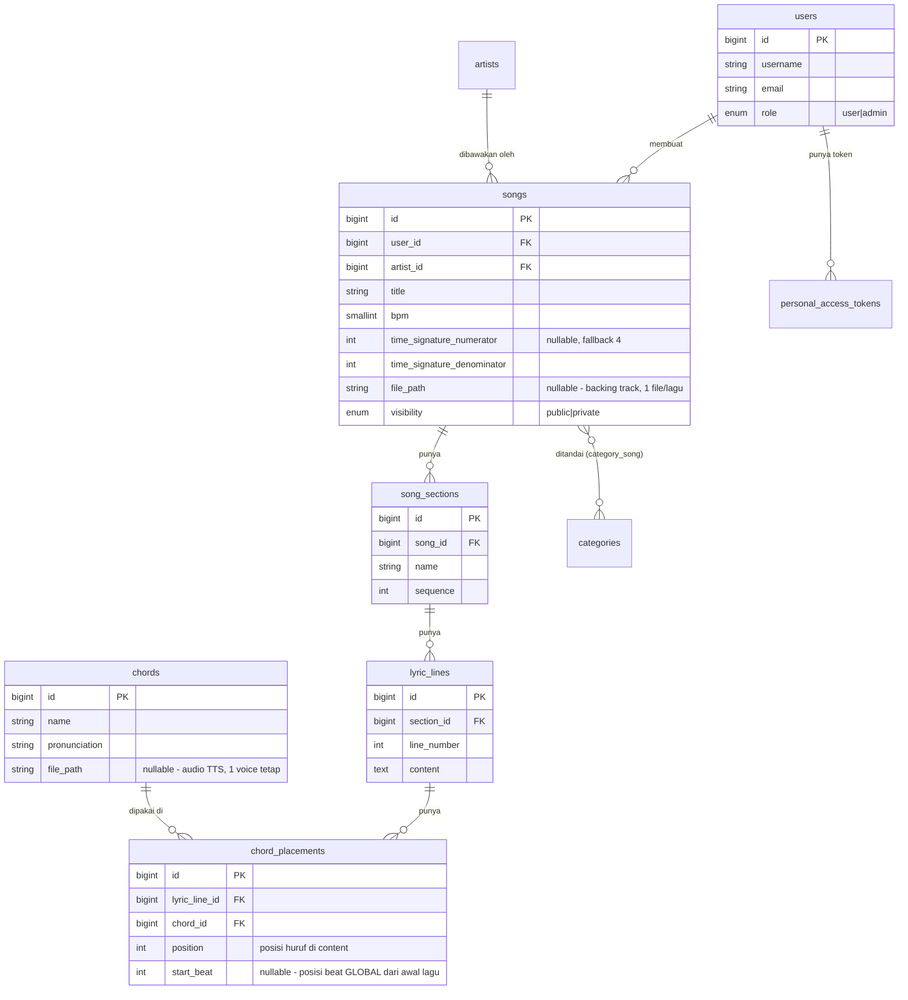
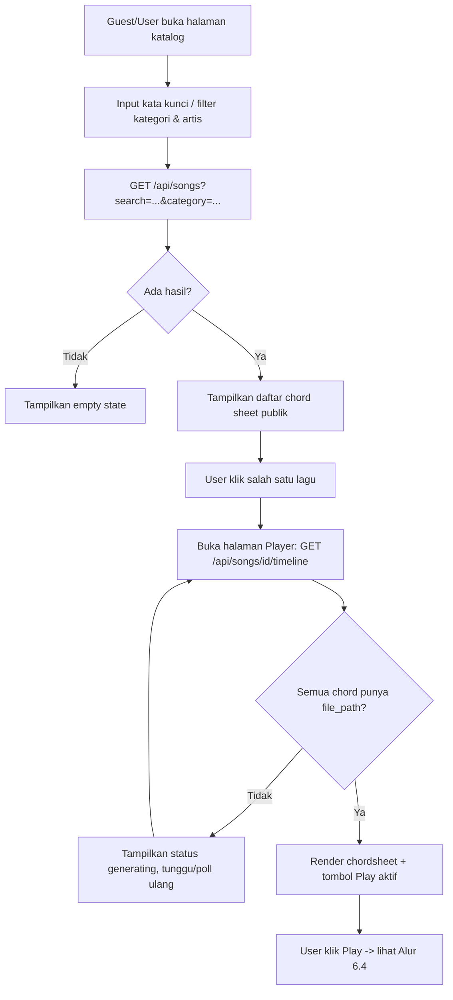
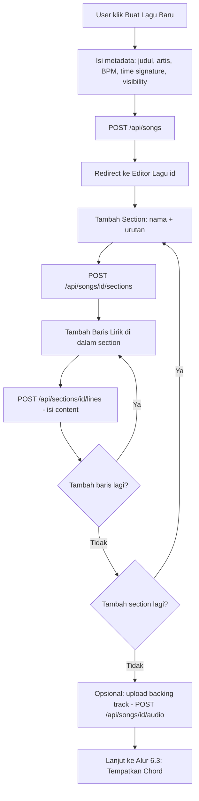
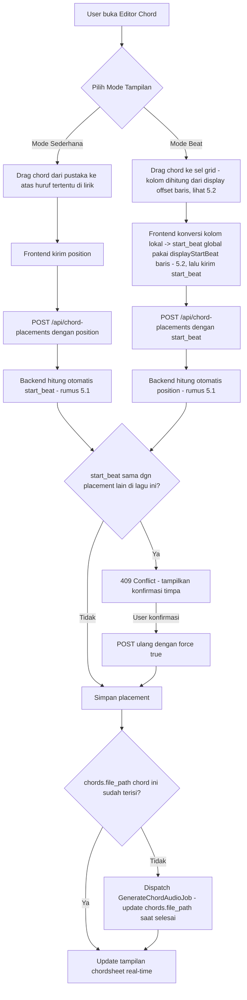
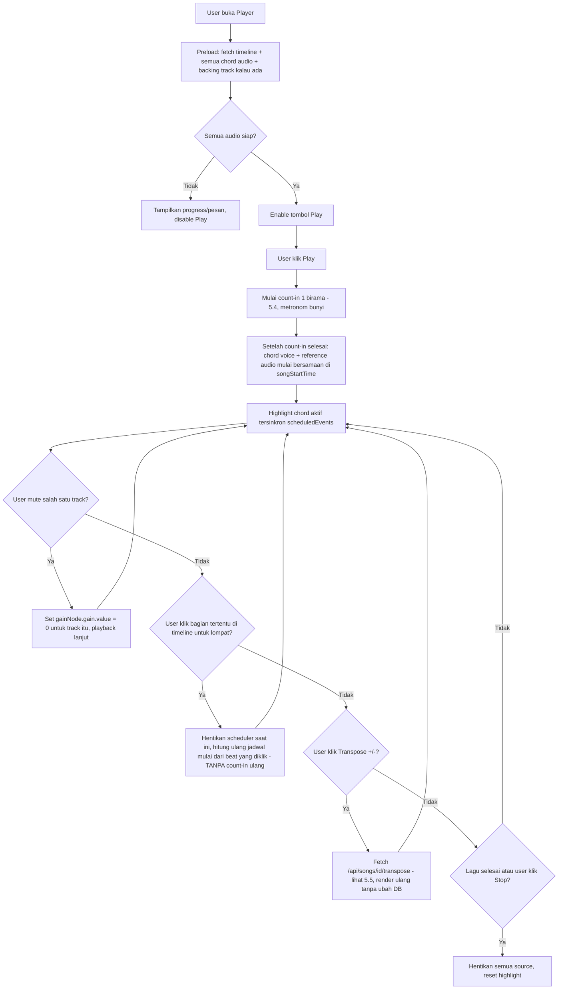

# ChordCue — Fase 5-6 (Lanjutan)
### Beat Editor, Audio Referensi, Katalog, Auth & Kuota

> **File ini adalah lanjutan dari** `TAHAP_1-4_ChordCue_Updated.md`. Fondasi yang dijelaskan di
> file itu (Audio Engine, pipeline TTS, timeline, transpose, player dasar) **sudah selesai dan
> tidak diulang di sini** — dokumen ini murni memperluasnya dengan modul-modul baru.

**Dokumen ini adalah acuan tunggal (single source of truth)** untuk tim development maupun untuk
agent/Gen AI lain yang mengerjakan bagian dari sistem ini.

Setiap keputusan desain di bawah sudah final berdasarkan diskusi dengan product owner — kalau ada
bagian yang menurut pelaksana ambigu di lapangan, **konfirmasi dulu**, jangan berasumsi sendiri.

---

## 1. Ringkasan Produk

ChordCue adalah aplikasi web (Laravel + Vanilla JS/Web Audio API) tempat pengguna bisa:

1. **Mencari & membaca** chord sheet lagu yang sudah dibuat pengguna lain (katalog publik).
2. **Membuat chord sheet sendiri** — lirik per baris, dikelompokkan per section (Verse, Chorus,
   dll), lalu menempatkan chord dengan drag-and-drop, baik ke posisi huruf tertentu di lirik
   (tampilan sederhana) maupun ke sel bar/beat tertentu (tampilan editor presisi).
3. **Melatih iringan** dengan memutar lagu secara presisi: metronom, suara chord (TTS), dan audio
   referensi (backing track hasil upload) diputar bersamaan, masing-masing bisa di-mute, dan
   pengguna bisa lompat manual ke bagian tertentu untuk fokus latihan pada bagian yang belum bisa.

Fondasi backend (queue TTS, audio caching, scheduler presisi berbasis `AudioContext`) **sudah
dibangun** di iterasi sebelumnya (disebut di sini sebagai **Tahap 1-4**) dan **tidak diulang dari
nol** — dokumen ini memperluasnya. Ringkasan apa yang sudah ada ada di §9.

---

## 2. Aktor & Peran

| Peran | Deskripsi | Batasan |
|---|---|---|
| **Guest** (belum login) | Bisa mencari & memutar/melihat chord sheet yang `visibility = public` | Tidak bisa membuat/edit apapun |
| **User** | Guest + bisa membuat, mengedit, menghapus chord sheet miliknya sendiri | Dibatasi kuota jumlah lagu aktif (lihat §8.3) |
| **Admin** | User + bisa mengelola/menghapus lagu & user manapun, mengatur kuota global | Tidak dibatasi kuota |

Auth memakai **Laravel Sanctum** (tabel `personal_access_tokens` sudah ada di migration). Detail
implementasi endpoint auth & kuota adalah **Fase 6** di roadmap §10, skema datanya sudah siap.

---

## 3. Modul/Fitur Utama

| Kode Modul | Nama | Ringkasan |
|---|---|---|
| M1 | Katalog & Pencarian | Cari chord sheet publik by judul/artis/kategori |
| M2 | Editor Struktur Lagu | CRUD metadata lagu, section, baris lirik |
| M3 | Editor Chord — Mode Sederhana | Drag chord ke atas huruf tertentu di lirik |
| M4 | Editor Chord — Mode Beat | Drag chord ke grid bar/beat, ditampilkan berlapis per baris tapi berbagi satu timeline beat global |
| M5 | Pustaka Chord | Daftar chord siap pakai + tambah chord custom |
| M6 | Audio Referensi Lagu | Upload 1 file backing track per lagu (`songs.file_path`) |
| M7 | Player Latihan | Play/pause dengan count-in, mute per-track, jump manual, transpose sesi |
| M8 | Pipeline Audio TTS | *(sudah ada, Tahap 2, direvisi §13)* generate & simpan suara chord langsung ke `chords.file_path` |
| M9 | Auth & Kuota | Login, role Admin/User, batas jumlah lagu (Fase 6) |

---

## 4. Skema Data (ERD) — Sesuai Migration Aktual

### 4.1 Diagram Entitas



### 4.2 Skema Ini Sudah Final — Tidak Ada Migration Tambahan yang Diperlukan

Berbeda dari draf pertama, **tidak ada** kolom baru yang perlu ditambahkan untuk mendukung modul
di dokumen ini. Migration yang sudah dibuat (`chords.file_path`, `songs.file_path`,
`chord_placements.position` + `start_beat`) **sudah cukup**. Yang berubah adalah **cara aplikasi
memakainya**, dijelaskan di §5.

Poin penting soal semantik kolom (wajib dipahami sebelum implementasi):

- **`chords.file_path`** — path audio TTS hasil generate, **satu voice tetap** untuk seluruh
  sistem (bukan per user/per request). Voice default dikonfigurasi via `.env`
  (`TTS_DEFAULT_VOICE`, misal `en-US-AriaNeural`), sama untuk semua chord. `null` berarti audio
  belum pernah digenerate.
- **`songs.file_path`** — path **1 file** backing track per lagu. File yang diupload **diasumsikan
  sudah dipotong (trim) oleh user** supaya beat pertama file itu = beat pertama lagu (detik ke-0 di
  file = beat 1). Sistem **tidak** menyediakan kalibrasi offset manual — sinkronisasi memakai
  mekanisme count-in (§5.4).
- **`chord_placements.position`** — index karakter di `lyric_lines.content`, dipakai Mode
  Sederhana.
- **`chord_placements.start_beat`** — posisi beat **global** dihitung dari awal lagu (bukan dari
  awal baris), dipakai langsung oleh `AudioEngine` sebagai nilai `beat` di `playSongTimeline()`
  (Tahap 3, tidak berubah). Satu lagu = satu garis waktu beat tunggal, terlepas dari baris/section
  mana chord itu ditempatkan.

---

## 5. Algoritma Inti

### 5.1 Dual-Koordinat: `position` (huruf) ↔ `start_beat` (global)

Karena disepakati satu chord placement merepresentasikan data yang sama di kedua mode, sistem
tetap butuh fungsi konversi dua arah — tapi sekarang langsung antara **posisi huruf** dan
**posisi beat global** (tanpa langkah antara bar/beat lokal seperti draf pertama).

**Masalahnya:** untuk interpolasi proporsional (dari posisi huruf ke posisi beat), sistem perlu
tahu "baris ini merentang dari beat berapa sampai beat berapa" — tapi karena `lyric_lines` **tidak
punya kolom durasi/bar_count**, rentang ini **tidak disimpan**, melainkan **diestimasi secara
dinamis** dari placement lain yang sudah ada di baris yang sama:

```
// Estimasi rentang beat sebuah baris (dipanggil setiap kali butuh konversi)
existingPlacements = chord_placements dengan lyric_line_id yang sama, punya start_beat terisi

jika existingPlacements kosong:
    // baris ini belum punya chord sama sekali — asumsikan default 1 bar penuh
    // (beats_per_bar dari songs.time_signature_numerator, fallback 4 kalau null)
    lineStartBeat = beat setelah baris sebelumnya berakhir (lihat §5.2 auto-continuation)
    lineEndBeat   = lineStartBeat + beats_per_bar - 1
jika ada existingPlacements:
    lineStartBeat = MIN(start_beat) pada existingPlacements
    lineEndBeat   = MAX(start_beat) pada existingPlacements
    // kalau chord baru diposisikan sebelum/sesudah rentang ini, rentang melebar mengikuti
```

```
// --- position -> start_beat, dipakai saat user drag chord ke huruf tertentu (Mode Sederhana) ---
fraction = position / max(length(content) - 1, 1)
start_beat = round(lineStartBeat + fraction * (lineEndBeat - lineStartBeat))

// --- start_beat -> position, dipakai saat user drag chord ke sel grid tertentu (Mode Beat) ---
fraction = (start_beat - lineStartBeat) / max(lineEndBeat - lineStartBeat, 1)
position = round(fraction * max(length(content) - 1, 0))
```

**Aturan penting (sama seperti draf pertama, tetap berlaku):**
- Saat placement dibuat dari salah satu mode, koordinat mode satunya dihitung otomatis & disimpan.
- Saat placement dipindah dari mode manapun, **kedua** kolom (`position` dan `start_beat`)
  ditulis ulang.
- Tabrakan (`start_beat` sama persis dengan placement lain, lintas baris manapun — karena ini
  timeline **global** tunggal, dua chord tidak boleh dijadwalkan di beat yang sama sekalipun beda
  baris) ditolak dengan `409 Conflict`, perlu `force: true` untuk menimpa.

### 5.2 Auto-Continuation — Render Grid Beat Editor per Baris

Beat Editor menampilkan grid **berlapis per baris** (sesuai referensi UI), tapi seluruh baris
berbagi **satu timeline beat global** yang sama. Untuk merender ruler bar/beat tiap baris, baris
berikutnya otomatis melanjutkan dari beat tertinggi yang dipakai baris sebelumnya, dibulatkan ke
awal bar berikutnya — **ini murni logika render di frontend, tidak disimpan ke database**:

```
cumulativeBeat = 0   // reset di awal lagu
untuk setiap baris (urut by section.sequence, line_number):
    line.displayStartBeat = cumulativeBeat
    lineMaxBeatUsed = MAX(start_beat placement di baris ini) atau (cumulativeBeat + beats_per_bar - 1) kalau baris kosong
    // bulatkan ke kelipatan bar berikutnya supaya baris selanjutnya mulai di awal bar baru
    cumulativeBeat = ceil((lineMaxBeatUsed + 1) / beats_per_bar) * beats_per_bar
```

Kolom grid yang ditampilkan di baris tersebut = `start_beat - line.displayStartBeat`. Ini yang
membuat setiap baris di UI tampak mulai dari "Bar 1" lagi (seperti gambar referensi) padahal nilai
`start_beat` yang tersimpan di database tetap global/absolut.

### 5.3 Arsitektur Audio Playback (Multi-Track + Mute)

Tidak berubah dari draf pertama — tiga sumber (metronom, suara chord TTS, audio referensi)
dijadwalkan ke `AudioContext` yang sama, masing-masing lewat `GainNode` terpisah supaya mute tidak
menghentikan penjadwalan:

```
AudioContext
 ├─ metronomeGain (default 1.0) → destination
 ├─ chordVoiceGain (default 1.0) → destination
 └─ referenceAudioGain (default 1.0) → destination
```

### 5.4 Sinkronisasi Audio Referensi — Mekanisme Count-In (Revisi)

**Tidak ada lagi kalibrasi offset manual.** Sinkronisasi memakai count-in standar: metronom
berbunyi selama **1 pola ketukan penuh** (sebanyak `time_signature_numerator` beat, fallback `4`
kalau kolom itu `null`) sebelum lagu (chord + audio referensi) benar-benar mulai.

```javascript
const beatsPerBar = song.time_signature_numerator ?? 4;
const secondsPerBeat = 60 / song.bpm;
const countInDuration = beatsPerBar * secondsPerBeat;

const t0 = audioContext.currentTime + 0.1;        // buffer kecil sebelum count-in mulai
const songStartTime = t0 + countInDuration;         // beat 1 lagu yang sebenarnya

// Metronom: berbunyi dari t0, TERUS lanjut tanpa jeda ke seluruh lagu
// (count-in secara visual/audio adalah beat -4,-3,-2,-1 sebelum beat 1 lagu)
for (let beat = -beatsPerBar; beat < totalBeats; beat++) {
    scheduleSound('click', songStartTime + beat * secondsPerBeat);
}

// Chord voice: dijadwalkan seperti biasa, relatif ke songStartTime (bukan t0)
// (logika playSongTimeline() Tahap 3 tidak berubah, cuma base time-nya digeser)

// Audio referensi: mulai TEPAT di songStartTime, offset 0 (file diasumsikan sudah pas)
referenceSource.start(songStartTime, 0);
```

**Implikasi penting untuk UI:** saat upload backing track, tampilkan instruksi eksplisit ke user
("Pastikan file dimulai tepat di ketukan pertama, tanpa jeda/intro tambahan — sistem akan otomatis
memberi hitungan mundur 1 birama sebelum lagu dan audio referensi mulai bersamaan"). Ini
menggantikan seluruh alur kalibrasi §5.4 di draf pertama.

### 5.5 Transpose Sesi (tidak berubah secara konsep, hanya sumber cache-nya)

Transpose **tidak pernah** menulis ke `chord_placements`/`chords` milik suatu lagu. Endpoint
transpose menghitung nama chord baru (`ChordTransposer`), cek `chords.file_path` untuk chord hasil
transpose (bukan lagi query ke tabel cache terpisah — lihat §13), dispatch job generate kalau
`file_path` masih `null`, lalu kembalikan response timeline yang sudah ditransformasi tanpa
`UPDATE` apapun ke data lagu.

---

## 6. Alur Pengguna (User Flows)

### 6.1 Mencari & Memutar Chord Sheet Publik (Modul M1 + M7)



### 6.2 Membuat Chord Sheet Baru (Modul M2)



### 6.3 Menempatkan Chord — Drag and Drop (Modul M3, M4, M5)



Catatan chord custom: kalau user klik "+ Tambah Chord" dan mengetik nama yang belum ada di tabel
`chords`, tampilkan form kecil minta **teks pengucapan** (`pronunciation`) sebelum disimpan
(`Chord::firstOrCreate`) — sistem tidak menebak otomatis cara baca chord custom.

### 6.4 Sesi Latihan / Player (Modul M6, M7)



---

## 7. Kontrak API (Ringkasan Lengkap)

> Endpoint bertanda **(existing)** sudah diimplementasikan di Tahap 1-4 dan dipertahankan
> (kecuali disebutkan ada perubahan). Endpoint tanpa tanda adalah **baru**.

### 7.1 Katalog & Lagu

| Method | Endpoint | Deskripsi | Auth |
|---|---|---|---|
| GET | `/api/songs` | List lagu, filter `?search=&category=&artist_id=&visibility=` (default `public` utk guest) | Guest boleh |
| POST | `/api/songs` | Buat lagu baru **(existing)** | User |
| GET | `/api/songs/{song}` | Detail lagu + struktur lengkap **(existing)** | Guest kalau public |
| PATCH | `/api/songs/{song}` | Update metadata lagu **(existing)** | Owner/Admin |
| DELETE | `/api/songs/{song}` | Hapus lagu **(existing)** | Owner/Admin |
| POST | `/api/songs/{song}/audio` | Upload/replace backing track (multipart), set `songs.file_path` | Owner |
| DELETE | `/api/songs/{song}/audio` | Hapus backing track (`file_path` -> null) | Owner |
| GET | `/api/songs/{song}/timeline` | Timeline lengkap utk player **(existing, `audio_ready` sekarang cek `chords.file_path`, tambah field** `line_content`, `reference_audio_url`**)** | Guest kalau public |
| POST | `/api/songs/{song}/transpose` | Transpose seluruh lagu, read-only ke DB **(existing/audit, sumber cek audio sekarang `chords.file_path`)** | Guest kalau public |

### 7.2 Struktur Lagu

| Method | Endpoint | Deskripsi | Auth |
|---|---|---|---|
| POST | `/api/songs/{song}/sections` | Tambah section | Owner |
| PATCH | `/api/sections/{section}` | Update nama/urutan section | Owner |
| DELETE | `/api/sections/{section}` | Hapus section (cascade ke lines & placements) | Owner |
| POST | `/api/sections/{section}/lines` | Tambah baris lirik (`content`) | Owner |
| PATCH | `/api/lines/{line}` | Update isi lirik | Owner |
| DELETE | `/api/lines/{line}` | Hapus baris lirik | Owner |

### 7.3 Chord & Placement

| Method | Endpoint | Deskripsi | Auth |
|---|---|---|---|
| GET | `/api/chords` | List pustaka chord (preset + custom), termasuk `file_path`/status audio | Publik |
| POST | `/api/chords` | Tambah chord custom (`name`, `pronunciation`) — otomatis dispatch job generate audio | User |
| POST | `/api/chord-placements` | Tempatkan chord — body `{lyric_line_id, chord_id, position}` **atau** `{lyric_line_id, chord_id, start_beat}`, koordinat lain dihitung otomatis (§5.1). Tambahkan `force: true` untuk timpa tabrakan | Owner |
| PATCH | `/api/chord-placements/{id}` | Pindahkan placement (koordinat manapun), koordinat lain ikut dihitung ulang | Owner |
| DELETE | `/api/chord-placements/{id}` | Hapus placement | Owner |

### 7.4 Auth & User (Fase 6 — skema sudah siap via Sanctum)

| Method | Endpoint | Deskripsi |
|---|---|---|
| POST | `/api/register`, `/api/login`, `/api/logout` | Sanctum token-based auth |
| GET | `/api/me/quota` | Sisa kuota upload lagu milik user login |

---

## 8. Kebutuhan Non-Fungsional

### 8.1 Presisi Timing
- Semua penjadwalan bunyi wajib lewat `AudioContext.currentTime`/`source.start()` — tidak boleh
  ada `setTimeout` yang langsung memicu bunyi.
- Toleransi drift metronom: < 1ms per beat pada sesi 5 menit.
- Highlight visual chord aktif dihitung dari `scheduledEvents` yang sama dengan yang memutar
  bunyi.
- Count-in (§5.4) wajib konsisten setiap kali Play ditekan dari awal — durasi count-in dihitung
  ulang dari `time_signature_numerator` saat itu (bukan di-cache), karena BPM/time signature bisa
  saja diubah user di antara sesi latihan.

### 8.2 Upload Audio
- Format didukung: MP3, WAV, OGG (validasi MIME type di backend), berlaku baik untuk
  `songs.file_path` maupun hasil generate `chords.file_path`.
- Batas ukuran file upload backing track: 15MB per file (default, dikonfigurasi lewat `.env`).
- File `songs.file_path` disimpan di disk `public` Laravel — ini **beda dengan prinsip awal
  proyek** ("tanpa simpan ke storage") yang berlaku khusus untuk audio hasil TTS pengujian awal;
  file yang diupload user memang harus persisten.

### 8.3 Kuota Upload (Fase 6)
- Default: User biasa maksimal **10 lagu aktif** (placeholder, konfirmasi ke product owner
  sebelum Fase 6 dikerjakan).
- Lagu yang dihapus mengembalikan slot kuota. Admin tidak dibatasi.

### 8.4 Fallback Time Signature
- `songs.time_signature_numerator`/`denominator` bersifat `nullable` di skema. Di **semua**
  perhitungan beat (count-in, auto-continuation grid, konversi §5.1), kalau `numerator` bernilai
  `null`, sistem **wajib** fallback ke `4` (anggap 4/4) — jangan biarkan pembagian dengan nilai
  kosong menyebabkan error runtime.

---

## 9. Yang Sudah Dibangun (Tahap 1-4 — Fondasi, Jangan Diulang)

Detail lengkap (goal, kode, testing) ada di `TAHAP_1-4_ChordCue_Updated.md`. Ringkasnya:

- **Tahap 1**: `AudioEngine` (lookahead scheduler, presisi berbasis `AudioContext.currentTime`).
- **Tahap 2**: Pipeline generate audio via Edge TTS lewat Laravel Queue, menulis langsung ke
  `chords.file_path` (satu voice tetap, tanpa tabel cache terpisah).
- **Tahap 3 & 4 (digabung)**: `SongController` (CRUD dasar, `timeline()`, `transpose()`
  read-only), halaman player tunggal dengan render chordsheet sederhana + highlight sinkron.

Semua ini tetap dipakai apa adanya, hanya **diperluas** oleh modul-modul di dokumen ini.

---

## 10. Roadmap Fase Pengerjaan

| Fase | Cakupan | Bergantung Pada |
|---|---|---|
| **Fase 5a** | Revisi `GenerateChordAudioJob` (tulis ke `chords.file_path`, bukan cache table), service class untuk konversi §5.1 & auto-continuation §5.2 | Tahap 1-4 selesai |
| **Fase 5b** | Editor Mode Beat (grid berlapis per baris sesuai referensi UI) + Editor Mode Sederhana, drag-and-drop kedua arah | Fase 5a |
| **Fase 5c** | Upload backing track (`songs.file_path`) + integrasi count-in ke scheduler multi-track (§5.3, §5.4) | Fase 5a |
| **Fase 5d** | Player: mute per track, jump manual ke bagian tertentu | Fase 5b, 5c |
| **Fase 5e** | Katalog & pencarian (M1) | Tahap 4 (endpoint list songs sudah ada, tinggal tambah filter search) |
| **Fase 6** | Auth Sanctum, role Admin/User, kuota upload (M9) | Bisa paralel, tidak bergantung fase lain |

Setiap fase harus melalui checklist pengujian sendiri sebelum lanjut ke fase berikutnya (pola sama
seperti Tahap 1-4). Minta breakdown detail per-fase (goal/skema-kode/testing) secara terpisah kalau
dibutuhkan, supaya dokumen ini tidak terlalu panjang.

---

## 11. Asumsi & Batasan yang Diambil (Wajib Dibaca)

1. **Voice TTS tunggal** untuk seluruh sistem (bukan per chord/per user), dikonfigurasi via
   `.env`. Kalau nanti butuh multi-voice, ini perlu revisi skema (`chords.file_path` harus kembali
   jadi tabel terpisah).
2. **Rentang beat sebuah baris diestimasi dinamis** dari placement yang sudah ada di baris itu
   (§5.1), bukan disimpan eksplisit. Konsekuensinya: hasil konversi `position ↔ start_beat` bisa
   sedikit bergeser kalau user menambah chord baru di ujung rentang baris yang sama — ini
   trade-off yang diterima demi menghindari kolom `bar_count` tambahan.
3. **Backing track diasumsikan sudah pre-trimmed** oleh user (mulai tepat di beat 1). Sistem tidak
   memvalidasi ini secara otomatis — kalau file user tidak pas, hasil sinkron akan meleset dan itu
   tanggung jawab user saat upload (didampingi instruksi UI yang jelas, §5.4).
4. **Fallback 4/4** dipakai di semua kalkulasi kalau `time_signature_numerator` kosong (§8.4).
5. **Tabrakan `start_beat`** ditolak dengan konfirmasi timpa (bukan auto-geser), berlaku **lintas
   baris** karena timeline-nya global — dua baris berbeda tidak bisa punya chord di beat global
   yang sama persis.
6. **Kuota default 10 lagu/user** adalah placeholder, perlu konfirmasi final sebelum Fase 6.
7. **Custom chord** butuh input manual `pronunciation` dari user, sistem tidak menebak otomatis.

---

## 12. Glosarium

| Istilah | Arti |
|---|---|
| **Beat** | Satu ketukan dasar sesuai `time_signature_numerator` |
| **Beat global** | Posisi beat dihitung dari awal lagu (bukan awal baris) — nilai yang disimpan di `chord_placements.start_beat` |
| **Count-in** | Hitungan mundur 1 birama penuh sebelum lagu (chord + audio referensi) mulai, metronom tetap bunyi selama itu |
| **Auto-continuation** | Logika render (bukan data tersimpan) yang menentukan baris mana lanjut dari beat berapa di tampilan Beat Editor |
| **Placement** | Satu penempatan chord tertentu pada satu titik (baris + `position`/`start_beat`) |

---

## 13. Ringkasan Perubahan dari Draf Pertama

| Area | Draf Pertama | Revisi Ini | Alasan |
|---|---|---|---|
| Cache audio TTS | Tabel `chord_audio_caches` (hash teks+voice) | Kolom `chords.file_path` langsung | Migration aktual sudah begini; disepakati 1 voice tetap cukup |
| Audio referensi | Tabel `reference_audio_tracks`, banyak file + `offset_seconds` | Kolom `songs.file_path`, 1 file, tanpa offset tersimpan | Migration aktual sudah begini; sinkron pakai count-in, bukan kalibrasi manual |
| Sinkronisasi presisi | User kalibrasi manual titik "beat 1" di dalam file | Count-in otomatis 1 birama sebelum lagu mulai | Lebih sederhana, tidak butuh UI kalibrasi & kolom tambahan |
| `chord_placements` | Direstrukturisasi total: `char_position` + `bar_number` + `beat_number` + `global_beat_cache` | **Tidak berubah** dari migration awal: `position` + `start_beat` (global) | Migration aktual tidak punya kolom bar/beat lokal; start_beat langsung dipakai sebagai global |
| `lyric_lines.bar_count` | Kolom baru diusulkan | **Tidak jadi ditambahkan** | Rentang beat baris diestimasi dinamis (§5.1), bukan disimpan |
| Beat Editor UI | Grid per baris dengan bar_number/beat_number lokal tersimpan | Grid per baris tetap tampil berlapis, tapi kolom cuma hasil render (auto-continuation §5.2), data tersimpan tetap 1 beat global | Menyamakan dengan keputusan "start_beat global, tampilan saja yang berlapis" |
